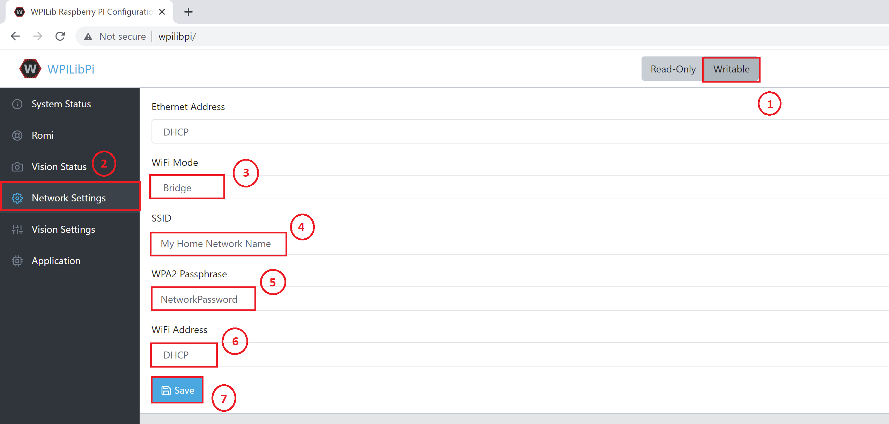

# **BB Workshop Network Instructions**
Please follow these instructions to setup your Romi prior to attending the Workshop. This is meant to prepare you so that your Romi, Pi, and PC are fully configured so that you can fully communicate with your robot from VS Code.

## **Recommended Software**
Here is a list of recommended software to install.
1. [FRC 2021 VS Code](https://github.com/wpilibsuite/allwpilib/releases/tag/v2021.3.1) for robot code (instructions for installation can be found [here](https://docs.wpilib.org/en/stable/docs/zero-to-robot/step-2/wpilib-setup.html))
2. [Romi image] Download from [here](https://dev.azure.com/wpilib/RuntimeSupport/_build/results?buildId=17296&view=artifacts&pathAsName=false&type=publishedArtifacts) and extract it you will use the file *WPILibPi_image-v2021.3.1-3-g7bd028a_2021-10-01-Romi.zip*.
2. [Etcher](https://www.balena.io/etcher/) if you need to image your Pi, use image above and instructions for installing [here](https://docs.wpilib.org/en/stable/docs/software/vision-processing/wpilibpi/installing-the-image-to-your-microsd-card.html)
3. [Angry IP Scanner](https://angryip.org/) for identifying IP address of Romi
4. [Bonjour](https://support.apple.com/kb/dl999?locale=en_US) for resolving Romi hostname of wpilibpi (necessary on Windows) 

## **Step 1: Imaging**
1. Start with the official [Romi instructions](https://docs.wpilib.org/en/stable/docs/romi-robot/imaging-romi.html)
2. Note that the Romi micro USB port should be connected to a Raspberry Pi USB port before powering on
3. When you get to **Wireless Network Setup**, if can't connect to [http://wpilibpi](http://wpilibpi) but can to IP address directly, your computer is struggling to resolve the hostname from mDNS. Try downloading and installing [Bonjour](https://support.apple.com/kb/dl999?locale=en_US)
4. Setup Pi Network settings
    1. Set Pi in update mode by clicking on the "Writable" on top of the web page.
    2. Navigate to "Network Settings" in the left navigation panel.
    3. "Wifi Mode" to Bridge
    4. "Wifi Address" to DHCP
    5. "SSID" to your local network name
    6. "WPA2 Passhrase" to the network password
    7. Click "Save" (just once). You connection will drop from the Pi.
   
   

5. Wait 15 seconds
6. Restart PI
7. Connect your computer to the local network if you have not done so already.
8. Open Angry IP Scanner
    1. Range should default to local network. Click Start.
	2. Once scan is complete, search for "wpilibpi.local" in hostname. It can take a minute or 2 for the Pi to fully boot, so if it doesn't show initially, try rescanning.
	3. Note IP address
    
    

## **Step 2: Troubleshooting**
**If wpilibpi.local does not show up on Angry IP Scanner:**
1. Open SD card on computer
2. Edit *wpa_supplicant_wpilibpi.conf*. Correct network name in the field ssid (in this example *My Home Network Name*), and password (in this example *NetworkPassword*) in field psk. The text should look like this:
    
```
ctrl_interface=DIR=/var/run/wpa_supplicant GROUP=netdev
update_config=1
country=US

###### BELOW THIS LINE EDITED BY RPICONFIGSERVER ######
network={
    ssid="My Home Network Name"
    psk="NetworkPassword"
}
```

3. Save, transfer to microSD card to the pi, restart
4. If still not working, check the batteries. Low voltage can be the problem.

## **Step 3: Test from VS Code**
1. Starting from the [Romi programming instructions](https://docs.wpilib.org/en/stable/docs/romi-robot/programming-romi.html)
2. In *build.gradle* file, update HALSIMWS_HOST to IP Address from Angry IP Scanner
3. Or, if able to resolve [http://wpilibpi](http://wpilibpi), replace code for websocket to be:

```def ROMI_IP 
try {
    ROMI_IP = java.net.InetAddress.getByName("wpilibpi.local").getHostAddress()
} catch (UnknownHostException e) {
    ROMI_IP = "10.0.0.2"
}

// Set the websocket remote host (the Romi IP address).
sim {
  envVar "HALSIMWS_HOST", ROMI_IP
}
```
4. Build and run code.

## **Step 4: Attend Workshop**
If you wree able to coneect to the Romi you are in great shape. If you got Step 3 working such that you can actually interact with the robot, you are ahead of the game!